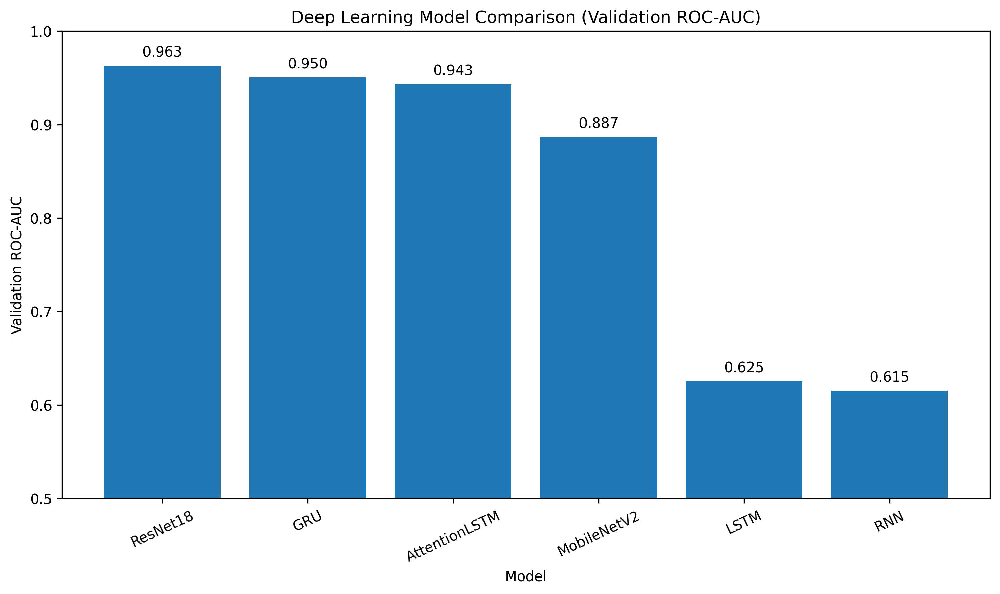
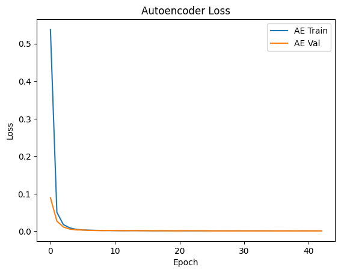
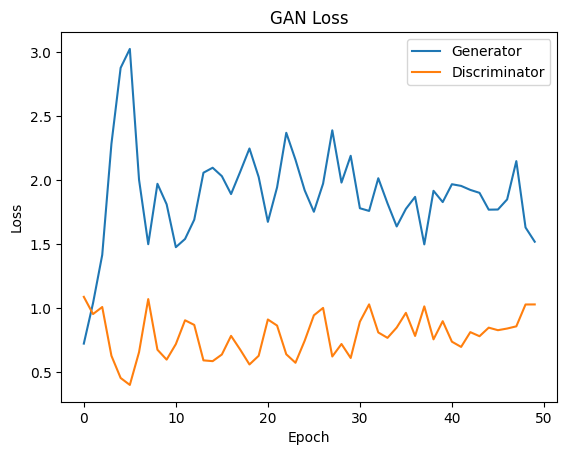
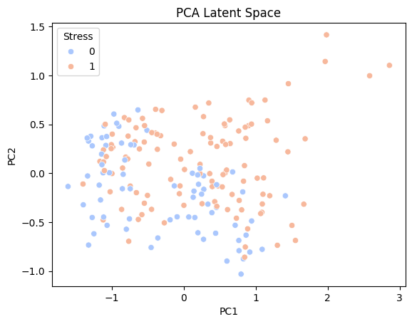
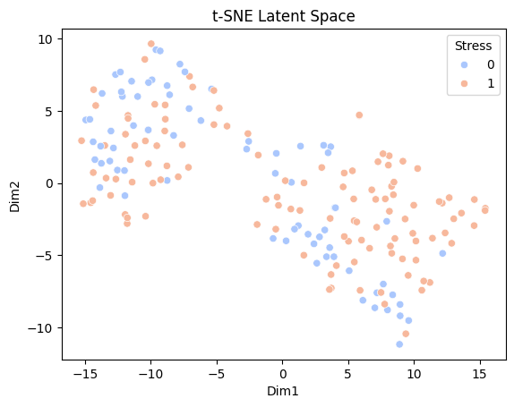
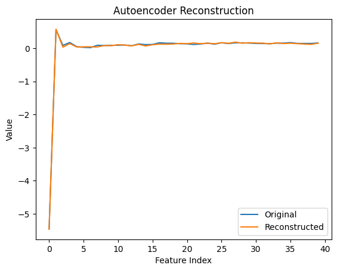
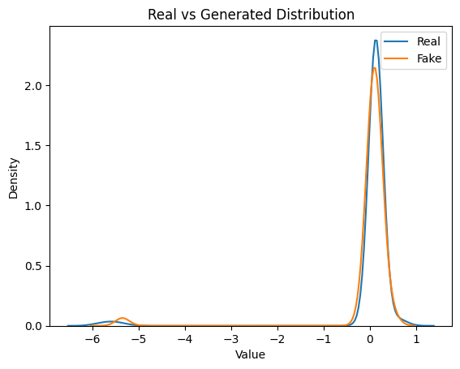
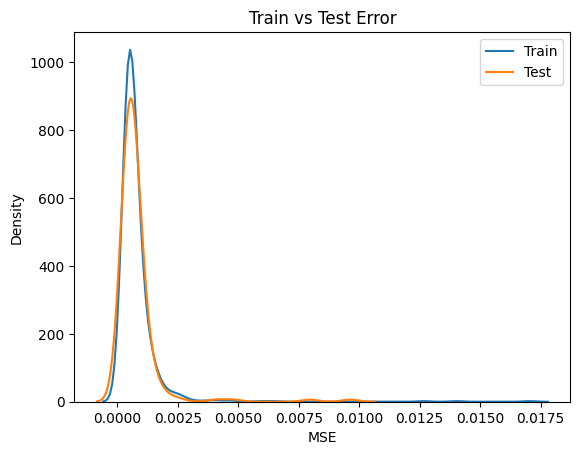
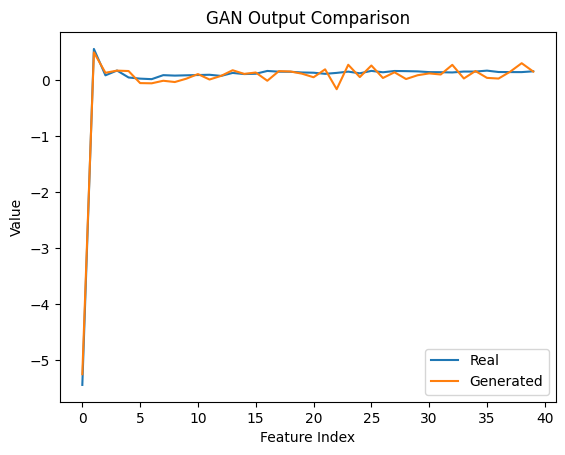

# Voice-Based Stress Detection using Deep Learning

Feel free to check the app in: https://voice-based-stress-detection.streamlit.app/

## Project Overview

This project focuses on detecting **stress levels from speech signals** using deep learning models. Speech contains temporal and acoustic patterns that reflect emotional states. The objective of the project is to classify speech recordings into **Low Stress** and **High Stress** categories.

The project is implemented as part of a **Deep Learning coursework scaffolded project** and consists of multiple stages evaluating different neural architectures.

---

## Dataset

We use the **RAVDESS Emotional Speech Audio Dataset**.

Dataset source:
https://www.kaggle.com/datasets/uwrfkaggler/ravdess-emotional-speech-audio

The dataset contains speech recordings from actors expressing different emotions.

For this project, emotions are mapped to stress levels:

Low Stress:

* Neutral
* Calm
* Sad

High Stress:

* Angry
* Fearful
* Disgust
* Surprised

---

## Project Structure

```
voice-stress-detection/
│
├── README.md
├── requirements.txt
│
├── Review1/
│   └── 25030-DL-Review1v5.ipynb
│
└── Review2/
│   └── 25030-DL-Review2v6.ipynb
│
└── Review3/
    └── 25030-DL-Review3v9.ipynb
```

---

## Review 1: Feature Representation and Baseline Models

Implemented models:

* Multi-Layer Perceptron (MLP)
* Convolutional Neural Network (CNN)

Key components:

* Audio preprocessing
* MFCC feature extraction
* Mel spectrogram generation
* Data visualization (waveforms, MFCC, spectrograms)
* Class imbalance analysis
* Baseline model training
* Overfitting control (dropout, early stopping)

Evaluation metrics:

* Accuracy
* F1 Score
* Confusion Matrix
* ROC Curve
* ROC-AUC

---

## Review 2: Temporal Modeling and Transfer Learning

Implemented models:

Sequence Models:

* RNN
* LSTM
* GRU
* Attention-based LSTM

Pretrained CNN Models:

* ResNet18
* MobileNetV2

Key techniques:

* Temporal sequence modeling
* Transfer learning
* Hyperparameter tuning
* Gradient clipping
* Early stopping
* Class weighted loss

---

## Evaluation Metrics

Models are evaluated using:

* Accuracy
* ROC-AUC
* Confusion Matrix
* Classification Report
* ROC Curves

---

## Results Summary

Typical performance trend observed:

| Model       | Performance                                  |
| ----------- | -------------------------------------------- |
| RNN         | Baseline temporal model                      |
| LSTM        | Improved long-term dependency modeling       |
| GRU         | Efficient gated recurrent network            |
| ResNet18    | Strong performance on spectrogram features   |
| MobileNetV2 | Lightweight CNN with competitive performance |

---

## Final Model Comparison

| Model | Validation ROC-AUC |
|------|--------------------|
| ResNet18 | 0.963 |
| GRU | 0.950 |
| Attention LSTM | 0.943 |
| MobileNetV2 | 0.887 |
| LSTM | 0.625 |
| RNN | 0.615 |

### Performance Visualization



---

## Review 3: Generative Modeling (Autoencoder & GAN)

### Autoencoder
- Learns compressed **latent representations** of speech features
- Reconstructs input features
- Helps analyze feature redundancy and structure

### Generative Adversarial Network (GAN)
- Generator produces synthetic feature vectors
- Discriminator distinguishes real vs fake data
- Learns underlying data distribution

---

## Training Strategy and Stability

To ensure stable training:

- **Early Stopping** prevents overfitting
- **Batch Normalization** improves convergence
- **Label Smoothing** stabilizes GAN training
- Balanced Generator–Discriminator updates
- Hyperparameter tuning:
  - Learning rate
  - Batch size

---

## Latent Space Analysis

Latent representations are visualized using:

- **PCA (Principal Component Analysis)**  
  → Captures global variance structure

- **t-SNE (t-Distributed Stochastic Neighbor Embedding)**  
  → Captures local clustering patterns

These visualizations help observe **stress-level separability in latent space**.

---

## Evaluation Metrics

### Autoencoder
- Reconstruction Mean Squared Error (MSE)
- Error distribution analysis
- Train vs Test comparison (generalization)

### GAN
- Mean and standard deviation comparison
- Distribution overlap (real vs generated)
- Diversity check (mode collapse detection)

---

## Results Summary

Key observations:

- Autoencoder learns meaningful latent representations
- Latent space shows clustering of stress categories
- GAN generates realistic feature distributions
- No significant mode collapse observed
- Model generalization verified using train vs test error comparison

---

## Performance Visualization

- Autoencoder loss (train vs validation) <br><br>
 <br><br>

- GAN loss (Generator vs Discriminator) <br><br>
 <br><br>

- Latent space plots (PCA & t-SNE) <br><br>
 <br><br>
 <br><br>

- Reconstruction vs original signals <br><br>
 <br><br>

- Real vs generated sample comparison <br><br>
 <br><br>

- Summary: <br>
AE Test MSE: 0.00078556006 <br>
GAN Mean Diff: 0.023843948 <br>
GAN Std Diff: 0.04207194 <br><br>

 <br><br>
 <br><br>

---

## Reproducibility

Experiments are made reproducible using fixed random seeds for:

* Python random
* NumPy
* PyTorch

---

## Installation

Clone the repository:

```
git clone https://github.com/VK11-7/Voice-Based-Stress-Detection.git
cd voice-stress-detection
```

Install dependencies:

```
pip install -r requirements.txt
```

---

## Running the Notebooks

Open the notebooks using Jupyter or VS Code:

Review 1 notebook:

```
Review1/25030-DL-Review1v5.ipynb
```

Review 2 notebook:

```
Review2/25030-DL-Review2v6.ipynb
```

Review 3 notebook:

```
Review3/25030-DL-Review3v9.ipynb
```

Run all cells sequentially.

---

## Author
Varadharajan K <br>
Deep Learning Coursework Project: Voice-Based Stress Detection
